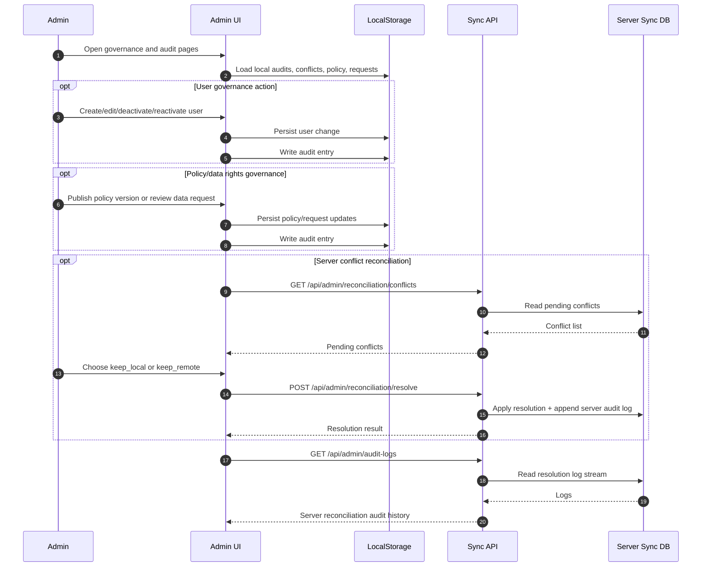

# Admin Sequence

## Primary Flow: Governance, Reconciliation, and Audit Oversight

## Data Touchpoints

- System users
- Policy versions and acceptances
- Data requests
- Local and server reconciliation conflicts
- Local audit logs and server admin resolution logs
