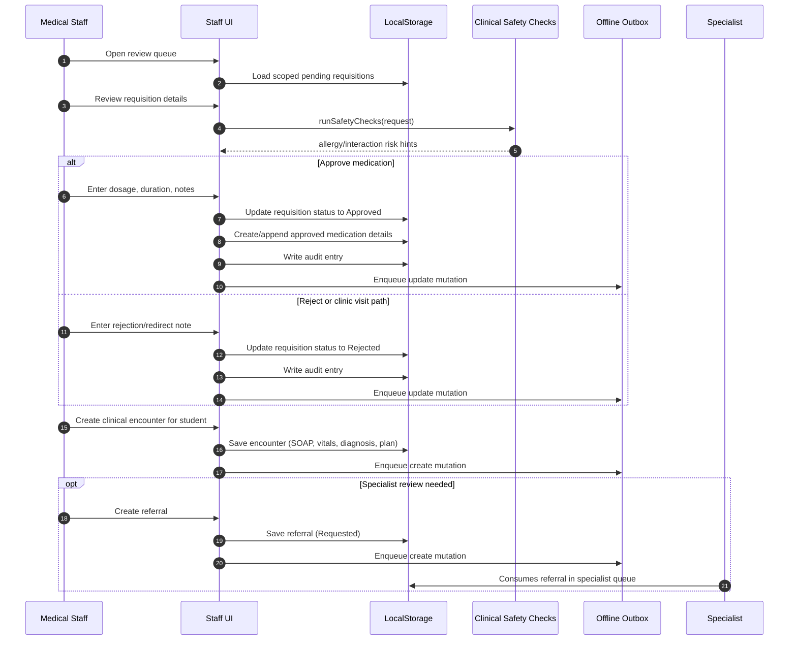

# Medical Staff Sequence

## Primary Flow: Triage, Encounter, and Referral

```mermaid
sequenceDiagram
  autonumber
  participant Staff as Medical Staff
  participant UI as Staff UI
  participant Store as LocalStorage
  participant Safety as Clinical Safety Checks
  participant Queue as Offline Outbox
  participant Spec as Specialist

  Staff->>UI: Open review queue
  UI->>Store: Load scoped pending requisitions

  Staff->>UI: Review requisition details
  UI->>Safety: runSafetyChecks(request)
  Safety-->>UI: allergy/interaction risk hints

  alt Approve medication
    Staff->>UI: Enter dosage, duration, notes
    UI->>Store: Update requisition status to Approved
    UI->>Store: Create/append approved medication details
    UI->>Store: Write audit entry
    UI->>Queue: Enqueue update mutation
  else Reject or clinic visit path
    Staff->>UI: Enter rejection/redirect note
    UI->>Store: Update requisition status to Rejected
    UI->>Store: Write audit entry
    UI->>Queue: Enqueue update mutation
  end

  Staff->>UI: Create clinical encounter for student
  UI->>Store: Save encounter (SOAP, vitals, diagnosis, plan)
  UI->>Queue: Enqueue create mutation

  opt Specialist review needed
    Staff->>UI: Create referral
    UI->>Store: Save referral (Requested)
    UI->>Queue: Enqueue create mutation
    Spec->>Store: Consumes referral in specialist queue
  end
```

## Data Touchpoints

- Requisitions
- Encounters
- Referrals
- Audit logs
- Offline outbox
