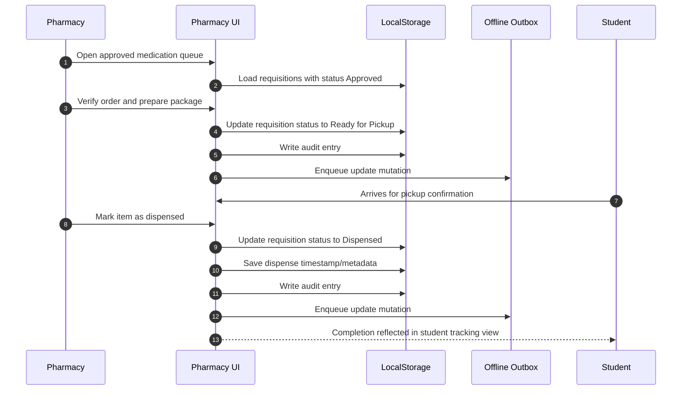

# Pharmacy Sequence

## Primary Flow: Dispense Approved Medication

## Status Highlights

- `Approved` -> `Ready for Pickup` -> `Dispensed`

## Data Touchpoints

- Requisitions
- Approved medication details
- Audit logs
- Offline outbox
