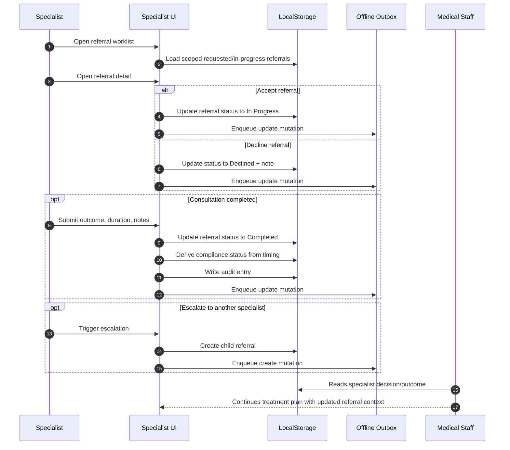

# Specialist Sequence

## Primary Flow: Referral Decision and Consultation Outcome

```mermaid
sequenceDiagram
  autonumber
  participant Spec as Specialist
  participant UI as Specialist UI
  participant Store as LocalStorage
  participant Queue as Offline Outbox
  participant Staff as Medical Staff

  Spec->>UI: Open referral worklist
  UI->>Store: Load scoped requested/in-progress referrals

  Spec->>UI: Open referral detail
  alt Accept referral
    UI->>Store: Update referral status to In Progress
    UI->>Queue: Enqueue update mutation
  else Decline referral
    UI->>Store: Update status to Declined + note
    UI->>Queue: Enqueue update mutation
  end

  opt Consultation completed
    Spec->>UI: Submit outcome, duration, notes
    UI->>Store: Update referral status to Completed
    UI->>Store: Derive compliance status from timing
    UI->>Store: Write audit entry
    UI->>Queue: Enqueue update mutation
  end

  opt Escalate to another specialist
    Spec->>UI: Trigger escalation
    UI->>Store: Create child referral
    UI->>Queue: Enqueue create mutation
  end

  Staff->>Store: Reads specialist decision/outcome
  Staff-->>UI: Continues treatment plan with updated referral context
```

## Data Touchpoints

- Referrals
- Referral compliance indicators
- Audit logs
- Offline outbox
