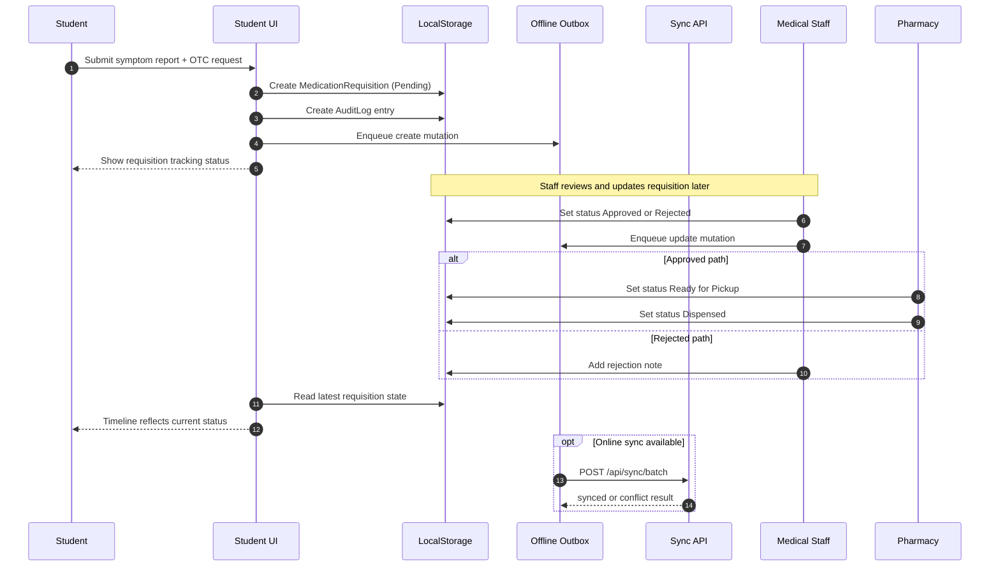

# Student Sequence

## Primary Flow: Submit Symptom and Track Requisition

## Status Highlights

- `Pending` -> `Approved` -> `Ready for Pickup` -> `Dispensed`
- `Pending` -> `Rejected`

## Data Touchpoints

- Medication requisitions
- Audit logs
- Offline mutation outbox
