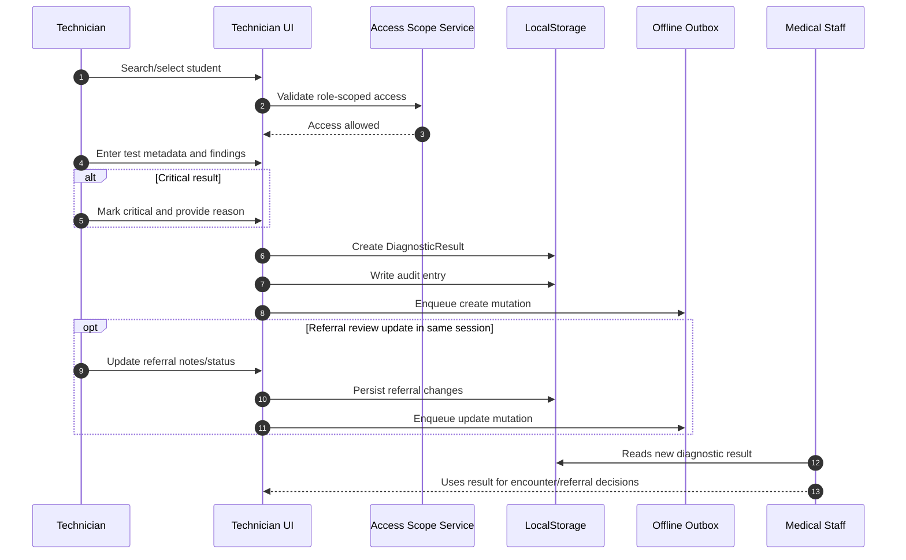

# Technician Sequence

## Primary Flow: Upload Diagnostic Result and Flag Critical Findings

## Data Touchpoints

- Diagnostic results
- Referrals (optional review edits)
- Audit logs
- Offline outbox
