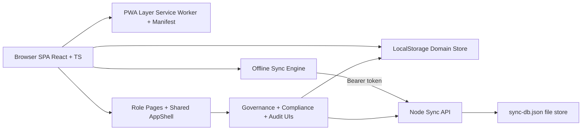

# SHR Website Technical Breakdown

## Audience and Scope

This document is a deep technical map of the SHR website implementation in this repository.

It covers:

- Frontend architecture, boot flow, routing, and role access control
- Data model and local persistence strategy
- Offline-first sync engine and conflict reconciliation
- PWA install, caching, update, and background sync behavior
- Backend sync API internals and security controls
- End-to-end workflows by role
- Governance, observability, compliance, and operational scripts

It is intentionally implementation-oriented and reflects the current code behavior.

## 1) System Profile

SHR is a role-based healthcare workflow SPA built with:

- React 18 + TypeScript + Vite
- React Router v6
- Tailwind CSS + Radix primitives
- LocalStorage-backed domain persistence
- Optional Node HTTP backend for sync, reconciliation, and server audit trails
- PWA support (service worker, manifest, install flow, offline fallback)

Primary roles:

- student
- medical_staff
- technician
- pharmacy
- specialist
- admin

## 2) High-Level Architecture

Design posture:

- Local-first UX and state changes
- Eventual consistency sync model when backend is reachable
- Frontend route and data access constrained by role scoping helpers

## 3) Runtime Boot Sequence

Boot starts in src/main.tsx.

1. bootstrapMockDataSafely()
   - Calls initializeMockData().
   - If malformed local data causes failure, clears known recoverable keys and reseeds.
2. initializeOfflineSync()
   - Registers online/offline listeners.
   - Auto-runs sync when online.
3. registerServiceWorker()
   - Production-only SW registration and PWA event wiring.
4. registerGlobalErrorHandlers()
   - Captures window error and unhandled promise rejection reports.
5. bootstrapEnhancements()
   - Seeds inbox/notifications/appointments and derives role workspace signals.
6. React render
   - StrictMode + App root.

Notable resilience behavior:

- Boot can recover from corrupted localStorage through deterministic key purge and reseed.

## 4) Provider Topology and Cross-Cutting Wrappers

App.tsx composes:

1. AppErrorBoundary
2. BrowserRouter
3. ToastProvider
4. AuthProvider
5. PwaNotifier
6. AppRouter
7. Vercel Analytics component

Responsibilities:

- AppErrorBoundary catches runtime React tree failures.
- ToastProvider surfaces global action feedback.
- AuthProvider manages session and role checks.
- PwaNotifier listens to PWA lifecycle events and raises UX toasts.

## 5) Routing and Access Control

Routing is centralized in src/router/AppRouter.tsx.

### 5.1 ProtectedRoute behavior

Guard pipeline:

1. If unauthenticated, redirect to /onboarding.
2. If role not allowed, redirect to /unauthorized.
3. If authenticated but has pending policy updates, redirect to /legal/policy-updates.
4. Else render route content.

### 5.2 RoleRedirect behavior

Root and onboarding redirect authenticated users to role homes:

- student -> /student/dashboard
- medical_staff -> /staff/dashboard
- technician -> /technician/upload
- pharmacy -> /pharmacy/queue
- specialist -> /specialist/dashboard
- admin -> /admin/dashboard

### 5.3 Route families

Public/legal routes include:

- /onboarding, /login, /unauthorized
- /legal and policy/legal documents
- /legal/pwa-diagnostics

Protected route families include:

- Student: /student/dashboard, /student/profile, /student/submit-symptom, /student/my-requisitions
- Medical staff: /staff/dashboard, /staff/search, /staff/patient/:studentId, /staff/patient/:studentId/encounter/new, /staff/review-queue, /staff/referral-feedback
- Technician: /technician/upload
- Pharmacy: /pharmacy/queue
- Specialist: /specialist/dashboard, /specialist/referrals, /specialist/analytics, /specialist/referral/:referralId
- Admin: /admin/dashboard, /admin/users, /admin/governance, /admin/audit-logs, /admin/reports, /admin/referral-compliance, /admin/data-requests, /admin/policy-versions, /admin/reconciliation, /admin/server-audit-logs
- Shared protected: /workspace, /settings

### 5.4 Scroll behavior

Two independent resets were implemented:

- Global window scroll reset per route change in AppRouter.
- Internal AppShell scroll container reset per path/search change.

This avoids stale mid-page viewport on mobile/embedded scroll surfaces.

## 6) Auth and Session Model

AuthContext is a local session simulator.

Key behaviors:

- Session key: shr_auth_session in localStorage.
- login(userId): mock async delay, verifies active user from shr_system_users, sets session key.
- logout(): clears session key and in-memory user/student.
- hasRole(): role or role array checks.
- currentStudent resolves only when current role is student.

There is no real password verification in runtime auth context. Demo login UX drives role identity from seeded users.

## 7) Data Model and Persistence Contracts

Canonical contracts are in src/types/types.ts and src/types/enhancements.ts.

Core domain entities:

- Student, Allergy, EmergencyContact
- Encounter, Vitals, Diagnosis, Prescription
- MedicationRequisition, ApprovedMedication
- DiagnosticResult
- Referral
- AuditLog
- SystemUser, SystemAlert
- DataRequest, PolicyVersion, PolicyAcceptance
- OfflineMutation, OfflineConflict, OfflineSyncSnapshot, OfflineSyncBundle

Enhancement entities:

- RoleInboxTask
- AppNotification
- FollowUpAppointment
- TimelineEvent
- DataQualityIssue
- SecurityEvent, TelemetryEvent
- PermissionOverride
- KpiReportSnapshot

### 7.1 Storage keys

StorageKey enum includes:

- shr_students
- shr_system_users
- shr_encounters
- shr_requisitions
- shr_referrals
- shr_diagnostic_results
- shr_audit_logs
- shr_system_alerts
- shr_data_requests
- shr_policy_versions
- shr_policy_acceptances
- shr_auth_session

Additional feature keys include:

- shr_offline_outbox
- shr_offline_conflicts
- shr_offline_last_synced_at
- shr_offline_device_id
- shr_api_auth_token
- shr_observability_events
- shr_security_events
- shr_kpi_snapshots
- shr_permission_overrides
- shr_role_inbox_tasks
- shr_notifications
- shr_follow_up_appointments
- shr_client_error_reports
- shr_initialized

## 8) Storage Service Mechanics

src/services/storage.ts provides generic CRUD wrappers:

- getAll
- getById
- create
- update
- deleteById

Cross-cutting behavior:

- create/update/delete enqueue offline mutations automatically.
- Auto-audit is enabled by default for create/update/delete (unless autoAudit: false).
- Audit resource types are mapped from storage keys.
- Large changeDetails payloads are JSON-truncated for audit safety.

This means most state transitions are both:

- Persisted locally immediately
- Buffered for eventual server sync

## 9) Seed Data Strategy

initializeMockData() in src/data/mockData.ts is idempotent.

First-run behavior:

- Seeds users, students, encounters, requisitions, results, referrals, audits, alerts, policy versions/acceptances, and data requests.
- Sets shr_initialized.

Subsequent-run behavior:

- Preserves prior data.
- Patches missing specialist user if absent.
- Seeds missing policy or referral collections if absent.

This supports schema evolution without always wiping browser data.

## 10) Privacy and Access Scoping Model

Role-scoped data visibility is enforced by src/services/accessScope.ts.

Key characteristics:

- Admin sees full datasets.
- Student sees own records via userId to studentId mapping.
- Non-admin roles are constrained to scoped subsets.
- Deterministic assignment by record ID hash is used for same-role partitioning.

Deterministic assignment is used in pending queues so multiple same-role users do not all process the same unresolved records.

Critical helper:

- canAccessStudentForUser(role, userId, studentId)

Patient workflow pages validate this before loading route-param records.

## 11) AppShell and Navigation Runtime

AppShell provides global frame and behavior:

- Navbar
- Sidebar (desktop + mobile drawer)
- Optional student mobile bottom nav
- Scroll progress bar
- Floating Top button
- Role workspace label strip
- Offline/online sync banners
- Footer legal/settings links

Mobile behavior:

- Sidebar is popup drawer with overlay and Escape close.
- Drawer closes on route change and nav click.
- Body scroll lock while drawer is open.

Navbar capabilities:

- Route title mapping
- Live clock chip
- Role workload chip
- Quick role action shortcut
- Notification center (read/resolve behavior)
- Command palette (Ctrl/Cmd + K)
- Demo user switcher
- PWA install CTA orchestration

## 12) Offline-First Sync Engine Deep Dive

Core service: src/services/offlineSync.ts

### 12.1 Mutation lifecycle

Mutations are enqueued with:

- id, storageKey, entityId
- action: create/update/delete
- payload and optional beforeSnapshot
- queuedBy user and role
- attempts, status
- deviceId

Statuses:

- pending
- synced
- failed
- conflict
- discarded

### 12.2 Sync execution algorithm

runOfflineSync():

1. Skip if offline.
2. Select pending + failed mutations.
3. Increment attempt counts.
4. POST batch to /api/sync/batch with deviceId and mutations.
5. Apply per-mutation result:
   - synced -> mark syncedAt
   - conflict -> create/update local conflict record
   - failed -> keep with lastError
6. Update outbox and snapshot.
7. Set lastSyncedAt if any mutation synced.

### 12.3 Conflict handling

Local conflicts:

- Stored in shr_offline_conflicts.
- resolveOfflineConflict(conflictId, keep_local|keep_remote)
  - keep_local -> mutation returns to pending with remote snapshot as beforeSnapshot.
  - keep_remote -> mutation becomes discarded.

Server conflicts:

- fetchServerReconciliationConflicts() for admin listing.
- resolveServerReconciliationConflict(conflictId, keep_local|keep_remote) to finalize server state.

### 12.4 Retry controls

- retryFailedOfflineMutations() resets failed -> pending.

### 12.5 Auth token for sync API

- Short-lived JWT cached in shr_api_auth_token.
- Token auto-refresh on expiry window.
- 401 retry path reissues token once.

### 12.6 Encrypted bundle export/import

For laptop transfer or offline ops continuity:

- buildOfflineBundle(passphrase)
- downloadOfflineBundle(passphrase)
- importOfflineBundle(bundleText, passphrase)

Crypto profile:

- PBKDF2 SHA-256, 150000 iterations
- AES-GCM 256-bit
- Random 16-byte salt, 12-byte IV
- Base64 encoding for transport fields

Import semantics:

- Merges by mutation/conflict ID
- Avoids duplicate injection

### 12.7 Snapshot subscription

subscribeOfflineSync(listener) emits:

- isOnline
- pendingCount
- failedCount
- conflictCount
- lastSyncedAt
- current outbox
- current conflicts

Used by AppShell and admin pages for live status.

## 13) PWA Subsystem

### 13.1 Registration strategy

registerServiceWorker():

- Dev mode: unregisters SW and deletes SHR cache prefixes (cleanup path).
- Production secure context: registers /sw.js on window load.

It emits custom events:

- shr:pwa-install-availability
- shr:pwa-offline-ready
- shr:pwa-update-available
- shr:pwa-app-installed

### 13.2 Install flow

- Captures beforeinstallprompt when available.
- Exposes promptPwaInstall() API.
- iOS fallback: manual install guide modal.
- HTTPS-required mode surfaced for mobile when needed.

### 13.3 Update flow

- applyPwaUpdate() posts SKIP_WAITING to waiting worker.
- Waits for controllerchange then reloads app.

### 13.4 Background sync bridge

- Registers SyncManager tag shr-sync-outbox.
- Service worker sync event posts TRIGGER_OFFLINE_SYNC to clients.
- App receives message and invokes runOfflineSync().

### 13.5 Manifest profile

manifest.webmanifest includes:

- standalone display and display_override
- start_url and scope root
- required 192 and 512 icons + maskable icon
- shortcuts for student dashboard, staff review queue, diagnostics
- screenshot metadata

### 13.6 Service worker caching model

public/sw.js behavior:

- Precache app shell and offline fallback.
- Navigation requests: network-first, fallback to offline.html or cached index.
- Same-origin API paths: network-only passthrough.
- Other GET requests: cache-first with runtime population.
- Cache version rotation on activate.

### 13.7 Offline fallback UX

offline.html provides:

- Offline status message
- Retry button
- Return home action

## 14) Backend Sync API Internals

Backend: backend/server.js
Storage: backend/data/sync-db.json

### 14.1 Runtime profile

- Node HTTP server (no framework)
- JSON file persistence
- CORS open to any origin
- Security headers: nosniff, frame deny, referrer policy, permissions policy

### 14.2 Auth model

Custom JWT issuance and verification:

- HMAC SHA-256 token signing
- Configurable secret and TTL
- Required claims: sub, role, exp
- Role must be one of valid role set

Headers for token issuance:

- x-shr-user-id
- x-shr-user-role

Bearer token required for protected endpoints.

### 14.3 Rate limiting

Sensitive routes are rate-limited by:

- client address + method + URL
- rolling window
- default 120 requests per 60 seconds

### 14.4 Sync and reconciliation endpoints

- GET /api/health
- POST /api/auth/token
- POST /api/sync/batch
- GET /api/admin/reconciliation/conflicts
- POST /api/admin/reconciliation/resolve
- GET /api/admin/audit-logs
- GET /api/admin/reports/summary

### 14.5 Observability/security ingestion endpoints

- POST /api/client-errors
- POST /api/telemetry
- POST /api/security/events

### 14.6 Conflict creation rule

Batch sync compares mutation.beforeSnapshot with current server record.
If mismatch, creates pending conflict and returns conflict status instead of applying mutation.

### 14.7 Admin conflict resolution semantics

- keep_local: apply local payload to server entity
- keep_remote: preserve remote value (or delete if remote null)

Each resolution appends immutable admin audit entry in server DB.

## 15) Legal and Compliance Workflows

### 15.1 Policy versioning and forced re-acceptance

- Admin can publish new policy versions (privacy/terms).
- Pending policy detection checks if user accepted latest version.
- ProtectedRoute redirects users with pending updates to /legal/policy-updates.
- Acceptance writes PolicyAcceptance and emits audit entries.

### 15.2 Data rights requests

DataRequestCenter supports:

- Access
- Correction
- Deletion

Each request:

- gets deterministic ticket format DR-YYYYMMDD-XXXX
- enters Submitted status
- is visible in user history and admin review center

AdminDataRequests supports status transitions:

- Submitted
- Under Review
- Approved
- Rejected
- Completed

All transitions emit review audit events.

## 16) Role Workflow Engines

### 16.1 Student workflow

- Dashboard: active request progress, latest encounter summary, allergy banner, emergency call shortcuts.
- Submit symptom report: 3-step wizard with symptom selection, OTC request selection, confirmation, and active-request guard.
- Requisition tracking: per-request timeline, conditional cards for pending/approved/rejected/ready/dispensed.
- Profile and history views are role-scoped.

### 16.2 Medical staff workflow

- Dashboard: queue KPIs, patient search, recent activity.
- StudentSearch: rich filters (department, blood group, active req, critical allergy).
- PatientProfile: full chart tabs (encounters, results, medications, requisitions), referral creation modal.
- NewEncounter: structured SOAP + vitals + ICD-10 + prescriptions with validation and autosave draft.
- DoctorReviewQueue:
  - triage pending requisitions
  - clinical safety pre-checks before approval
  - medication configuration modal
  - reject or direct clinic-visit path

### 16.3 Technician workflow

TechnicianUploadPortal:

- Student search constrained by scope.
- Result upload with file metadata simulation.
- Findings validation and optional critical flag reason.
- Referral review edit flow (status and notes) with audit entries.

### 16.4 Pharmacy workflow

PharmacyQueue:

- Kanban and list modes.
- State transitions: Approved -> Ready for Pickup -> Dispensed.
- Daily dispensed view and queue export simulation.

### 16.5 Specialist workflow

- Dashboard: assignment and outcome KPIs.
- Referrals worklist with status filter and queue age tracking.
- Referral detail lifecycle:
  - Accept or decline requested referral
  - Complete consultation with outcome, duration, notes
  - Auto compliance status from review latency
  - Escalate to another specialist (creates child referral)
- Consultation analytics aggregates completion and SLA metrics.

### 16.6 Admin workflow

- Dashboard: operations KPIs, charting, unresolved alerts, quick actions.
- UserManagement: create/edit/deactivate/reactivate/reset simulation.
- AuditLogs: advanced filtering + offline sync control center + encrypted bundle operations.
- ReconciliationCenter: local and server conflict comparison + resolution controls.
- AdminResolutionAuditLogs: immutable server-side resolution history.
- SystemReports: health/medication/compliance reports.
- ReferralCompliance: SLA and compliance overview.
- PolicyVersioning and DataRequest review pages.
- Governance center for quality, permissions, observability, and security events.

## 17) Enhancements Workspace Module

RoleWorkspacePage combines enhancement services into one operational console.

Features:

- Role inbox with SLA labels and escalation text
- Timeline search scoped to user role and identity
- Role-targeted notification feed
- Follow-up appointments completion flow
- Data quality issue feed (permission-gated)
- Security/observability explanatory cards
- Locale switcher (en/fr/yo) with scoped localStorage keying

Bootstrap source:

- bootstrapEnhancements() seeds and derives these models at startup.

## 18) Data Quality, Safety, Permissions, Observability

### 18.1 Data quality rules

runDataQualityScan() checks for:

- Missing emergency contact phone
- Empty allergy records
- Potential duplicate same-day requisitions
- Reviewed requisitions missing doctor note
- Completed referrals missing consultation notes
- Stale requested referrals beyond 48 hours

### 18.2 Clinical safety checks

runSafetyChecks() detects:

- Allergy conflicts with requested medications
- Duplicate medication request entries
- Dosage risk hint patterns
- Known interaction pair patterns

### 18.3 Permission model

- Base permissions per role are predefined.
- Optional role overrides allow/deny specific permission keys.
- Admin governance page updates overrides and logs telemetry/security events.

### 18.4 Observability model

Local streams:

- Telemetry events
- Security events
- KPI snapshots

Client error capture:

- error boundary source
- window error source
- unhandled rejection source

Shipping:

- sendBeacon if available
- fallback fetch keepalive

## 19) Testing and Verification Tooling

Package scripts:

- npm run dev
- npm run dev:api
- npm run build
- npm run lint
- npm run preview
- npm run smoke
- npm run smoke:enhancements

Smoke suite focuses on:

- route/component mapping sanity
- manifest icon/shortcut/screenshot checks
- service worker offline fallback checks
- enhancement route/service existence checks

## 20) Deployment and Runtime Environments

Frontend:

- Vite static deployment target
- Optional Vercel analytics integration

Backend:

- Node service deployable on Render/Railway
- Health check at /api/health

Key environment variables:

- PORT
- SHR_SYNC_TOKEN_SECRET
- SHR_SYNC_TOKEN_TTL_SECONDS
- SHR_RATE_LIMIT_WINDOW_MS
- SHR_RATE_LIMIT_MAX_REQUESTS
- VITE_API_BASE_URL (frontend to backend API base)

## 21) Security Posture and Known Constraints

Current controls:

- Role-based route guards
- Role-scoped data reads
- Offline mutation conflict checks using beforeSnapshot
- Bearer auth on sync and admin endpoints
- Basic rate limiting and security headers
- Audit logging across local and server resolution paths

Important constraints:

- Primary domain persistence is browser localStorage.
- Backend persistence is JSON file, not durable DB-grade in production.
- Auth is mock-oriented and not an enterprise identity provider.
- API CORS is permissive by default.

Production hardening priorities:

1. Replace JSON storage with relational durable store.
2. Integrate real identity and session controls.
3. Tighten CORS and endpoint authorization boundaries.
4. Add stronger abuse protections and centralized observability.
5. Add server-side domain validation and idempotency controls.

## 22) Extension Guide (Safe Evolution Path)

When adding a new workflow safely:

1. Extend contracts in types files first.
2. Add or reuse StorageKey and storage service access patterns.
3. Add seeded mock records for deterministic testability.
4. Use accessScope helpers for all non-admin page data reads.
5. Emit explicit audit events for high-value business actions.
6. Register protected routes with role gating in AppRouter.
7. If the feature mutates data, rely on storage wrappers to join offline sync pipeline.
8. Add smoke test assertions for critical route/asset/service wiring.

## 23) Operational Runbook Snippets

### Full local reset

1. localStorage.clear() in browser console.
2. Reload app.
3. Login with demo role.

### Force immediate sync attempt

- Use Sync Now action in AppShell or Admin Audit Logs sync center.

### Resolve offline conflicts

- Local conflicts: Admin Audit Logs panel or Reconciliation Center local section.
- Server conflicts: Reconciliation Center server section.

### Validate installability quickly

- Open /legal/pwa-diagnostics.
- Verify secure context, manifest link, icon sizes, SW registration, and prompt availability.

## 24) Summary

SHR is implemented as a local-first, role-segmented workflow system with optional backend-assisted reconciliation.

The architecture intentionally emphasizes:

- Deterministic in-browser behavior
- Strong workflow simulation fidelity
- Conflict-aware offline synchronization
- Auditable decision paths
- PWA-driven resilience on unstable networks

For the current codebase maturity level, this is a robust foundation for UX simulation, workflow validation, and phased hardening toward production-grade infrastructure.
